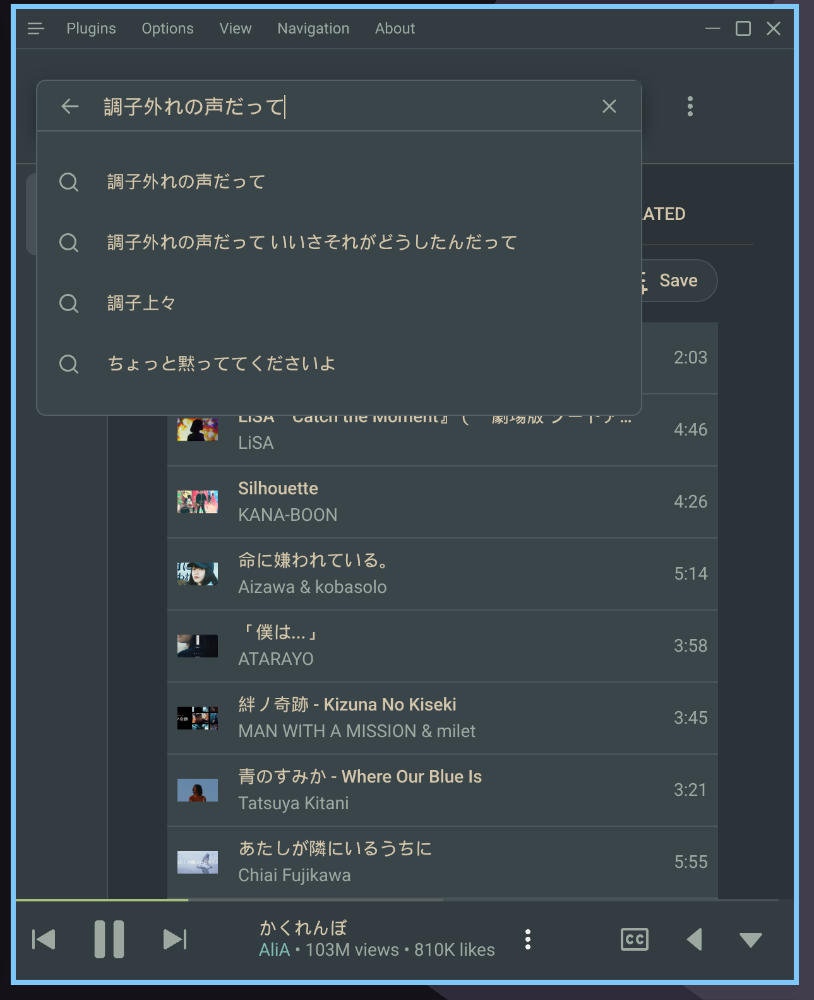
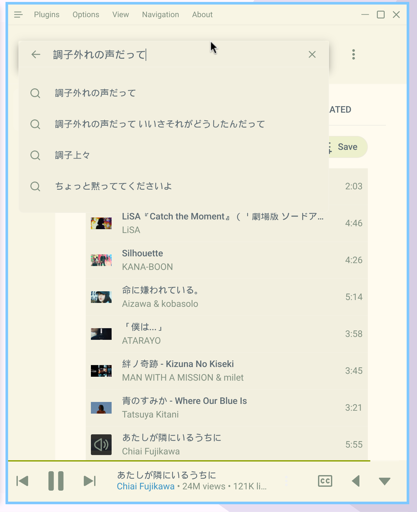

# YouTube Music Everforest Auto Theme

Auto-switching Everforest theme for **Pear Desktop / YouTube Music Desktop App**.

- **File:** `everforest-hard-auto.css`
- **Mode:** switches automatically via `prefers-color-scheme` (light/dark)
- **Palette:** based on `everforest-hard-light` and `everforest-hard-dark`

## Preview

### Dark theme

### Light theme

## Install

1. Open the app.
2. Go to **Options → Visual Tweaks → Themes**.
3. Import `everforest-hard-auto.css`.
